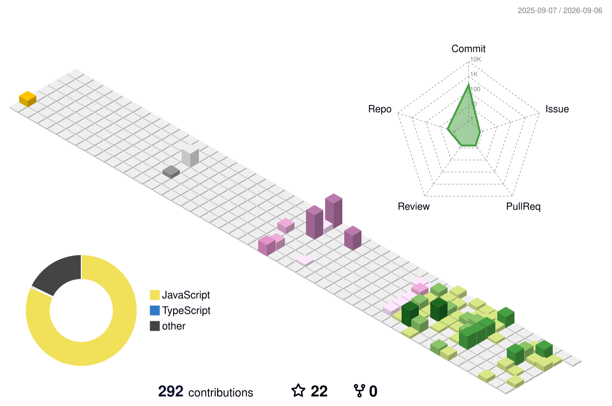

<div align="center">


<br>


</div>

---

# 👋 About Me

I'm **Darshan Modi**, an Information Technology student at **Birla Vishvakarma Mahavidyalaya (BVM)** and an aspiring **Software Development Engineer**.

I'm focused on building strong foundations in software engineering and developing real-world applications while continuously improving my problem-solving skills.

Currently focused on:

* ⚙️ Backend Development
* 🧩 System Design (HLD & LLD)
* 🗄️ Database Engineering (PostgreSQL, Prisma)
* 🧠 Data Structures & Algorithms in C++
* 🤖 AI-Powered Applications
* 💻 Computer Science Fundamentals
* 🐧 Linux Fundamentals

I enjoy learning by building projects and understanding how software systems work internally.

---

# 🚀 Current Focus

```text
Backend Development
System Design
MERN Stack
Real-Time Systems (Socket.IO)
Problem Solving (DSA in C++)
AI-Powered Applications
PostgreSQL & Prisma
Redis
Linux & Computer Science Fundamentals
```

---

# 🛠 Tech Stack

### Languages

<p>

</p>

### Web Development

<p>

</p>

### Database & Caching

<p>

</p>

### Tools & Platforms

<p>

</p>

---

# 💡 Featured Projects

## 🧠 Synapse

A collaborative workspace and project-management platform designed around organizational hierarchy, role-based access, real-time communication, file management, and AI-powered project assistance.

### Key Areas

* Workspace → Department → Team → Project → Task structure
* Role-Based Access Control (RBAC)
* Real-time communication using Socket.IO
* PostgreSQL with Prisma ORM
* Redis for caching and supporting real-time features
* AI-powered project assistance using RAG
* Vector search using Pinecone
* Authentication and authorization with JWT

---

## 🍔 FoodyFly

A full-stack **MERN food ordering application** built to practice real-world web application development.

### Key Areas

* Food ordering workflow
* User and application management
* REST API development
* MongoDB database
* React frontend
* Node.js and Express.js backend

---

## 🔍 AI Codebase Navigator

An AI-powered application that analyzes GitHub repositories and helps developers understand and navigate large codebases using AI and vector search.

### Key Areas

* GitHub repository analysis
* AI-powered codebase understanding
* Vector search
* RAG-based retrieval
* Pinecone
* Redis
* Supabase
* TypeScript

---

# 🎯 Career Objective

To become a strong **Software Development Engineer** capable of designing and building scalable, reliable, and intelligent software systems.

My goal is to strengthen my **DSA, system design, backend engineering, and computer science fundamentals** and eventually work in strong product-based engineering teams.

---

# 📚 Core Computer Science

* Data Structures & Algorithms (C++)
* Database Management Systems (DBMS)
* Computer Networking
* Operating System Fundamentals
* Computer Fundamentals
* Linux Fundamentals
* Problem Solving

---

# 🌐 Connect With Me

<p align="center">

<a href="mailto:darshanmodi016@gmail.com">

</a>

<a href="https://www.linkedin.com/in/darshan-modi-0b221b329">

</a>

<a href="https://leetcode.com/Darshan_Modi">

</a>

</p>

---

# 🏙️ GitHub Contribution Skyline (3D)

<div align="center">



<br>

<sub>
3D Contribution Skyline • Automatically updated every night • Theme rotates automatically
</sub>

</div>

---

# 📊 GitHub Analytics

<div align="center">


</div>

---

# 📈 Activity Graph

<p align="center">


</p>

---

# ⚡ Developer Philosophy

> Learn relentlessly.
>
> Build consistently.
>
> Improve continuously.
>
> Success is the result of small efforts repeated every day.

---

<div align="center">

### 🚀 Learning • Building • Growing

### ⭐ Thanks for visiting my profile!


</div>
